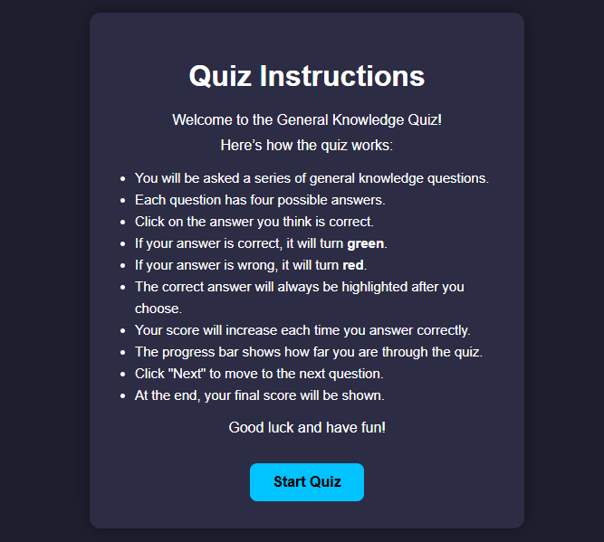
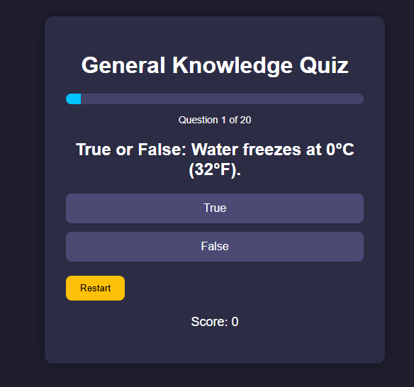
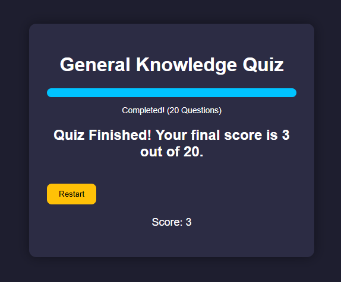
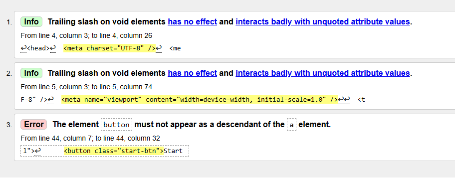
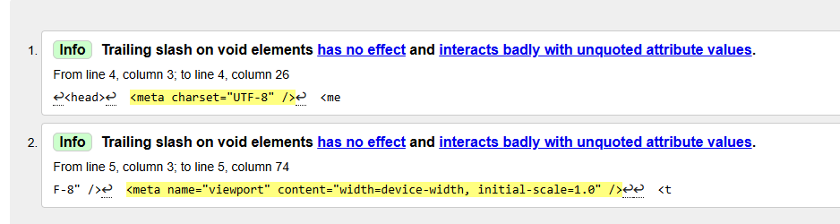
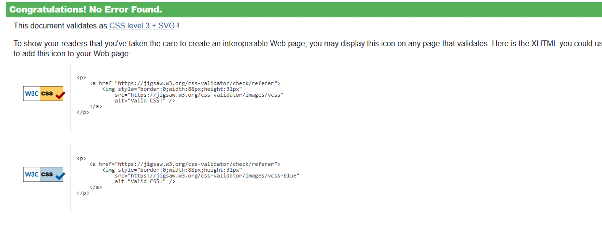
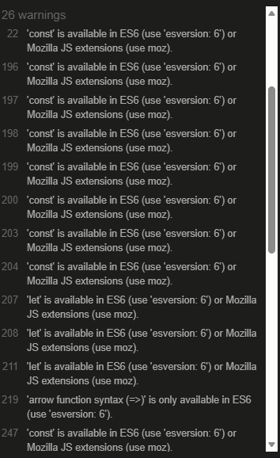
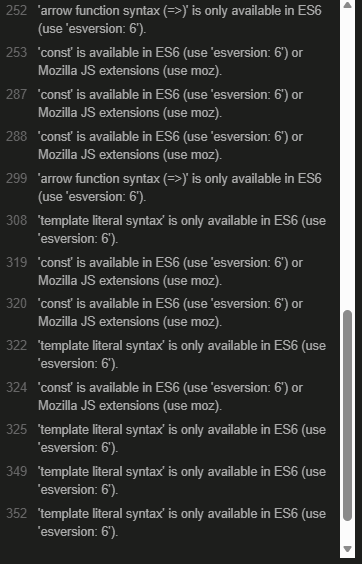

# General Knowledge Quiz App

A simple and beginner-friendly quiz application built using:

- HTML
- CSS
- JavaScript

Designed to work perfectly with:

- VS Code
- Live Server

---

# Features

## Quiz Features
- General knowledge questions
- Mixed question types:
  - Multiple choice
  - True / False
- Random question order every game
- Score tracking
- Progress bar
- Question counter
- Restart quiz button
- Correct and wrong answer highlighting
- Responsive and clean UI

---

# Project Structure

```text
quiz-app/
│── index.html        # Instructions page
│── quiz.html         # Main quiz page
│── style.css         # Styling
│── script.js         # Quiz logic
```

---

# How To Run

1. Open the project folder in VS Code
2. Install the Live Server extension
3. Right-click `index.html`
4. Click "Open With Live Server"

The instructions page will load first automatically.

---

# Screenshots

## Instructions Page



---

## Quiz Screen



---

## Final Results Screen



---

# Future Upgrade Ideas

- Timer per question
- High score saving
- Sound effects
- Difficulty modes
- Random answer shuffling
- Mobile app version

---

# Notes

This project was designed to be:
- Easy to understand
- Beginner friendly
- Fully commented
- Easy to expand and customize

---
# faults encountered

---

# testing performed

## W3C Validator




---

## JIGSAW Validator



---

## JSHINT Validator




---